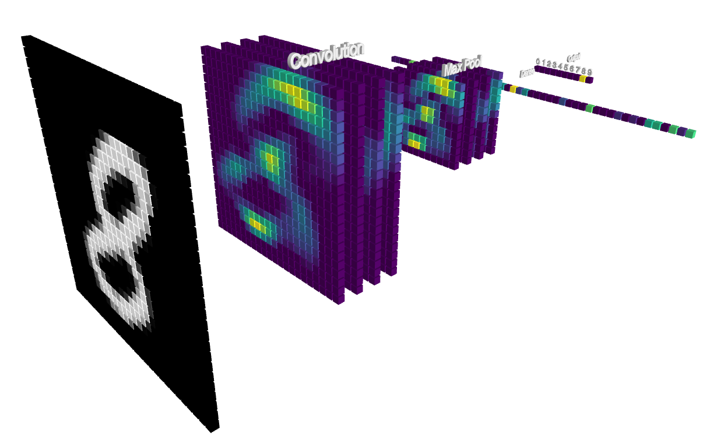

# TensorBlocks

A graphical neural network builder made with TensorFlow JS and ThreeJS. Works best on Chrome or Mozilla Firefox. 
[Website](http://tensorblocks.com)

## Roadmap:

- <del>Color connections</del>, visibility 
- Drag and drop layers together 
- Import/Export models 
- More datasets 
- Visualization tools 
- Large networks, new layers 
- Log and rank models 
- Import and connect datasets 
- <i>Aesthetics</i> 
